# Activity 3.0: Telegram Bot Foundation & Flow Design

## Overview

Design and implement the core Telegram bot architecture for HN Pal, including state management, message routing, inline buttons, and command handling. The bot operates in two primary states (IDLE and DISCUSSION) and delivers personalized HN digests to users via direct messages.

**Key Principle:** No channels, no groups. Just direct messages between user and bot.

---

## Prerequisites

- Activity 1.1: HN API polling (posts in database) ✅
- Activity 1.3: Content crawling (markdown in storage) ✅
- Activity 2.1: Summarization (summaries generated) 🔄
- PostgreSQL schema with users, posts, deliveries, conversations tables
- Telegram Bot Token (from @BotFather)

---

## Objectives

1. **Bot State Machine**: Implement IDLE ↔ DISCUSSION state transitions
2. **Message Routing**: Route user messages based on current state
3. **Inline Buttons**: Handle callbacks for Discuss, Read, Save, reactions
4. **Command System**: Implement /start, /pause, /saved, /memory, /token
5. **Digest Delivery**: Send formatted digests with Style 2 (flat scroll)
6. **Discussion Management**: Auto-switch posts, 30-min timeout, context loading
7. **Token Tracking**: Log all LLM API calls per user

---

## Technical Architecture

### Bot Framework

**aiogram 3.x** (async Python framework)

**Why aiogram 3.x:**
- Async/await native (matches our stack)
- Built-in FSM (Finite State Machine) for state management
- Clean middleware system
- Type hints throughout
- Active development and community

### Deployment Options

**Option 1: Polling (Development)**
- Simple long-polling for local dev
- Easy to debug and test

**Option 2: Webhook (Production - Vercel)**
- Vercel serverless function receives POST requests
- Endpoint: `/api/telegram-webhook`
- Processes updates asynchronously

**Recommendation:** Start with polling for development, migrate to webhook for production.

---

## Bot State Machine

### States Definition

**Three primary states:**
- `IDLE` - No active discussion
- `DISCUSSION` - Actively discussing a post
- `ONBOARDING` - /start flow, picking interests

### State Transitions

```
┌─────────────────────────────────────────────────┐
│                                                 │
│  /start                                         │
│    │                                            │
│    ▼                                            │
│  ONBOARDING ────pick interests───▶ IDLE         │
│                                     │           │
│                                     │           │
│  ┌──────────────────────────────────┘           │
│  │                                              │
│  │  [💬 Discuss] button pressed                │
│  │                                              │
│  ▼                                              │
│  DISCUSSION ──┐                                 │
│  │            │                                 │
│  │ msg        │ [💬 Discuss] another post       │
│  │ ▼          │ OR 30min timeout                │
│  │ route      │                                 │
│  │ to LLM     │                                 │
│  │            │                                 │
│  └────────────┴─────────▶ save convo ──▶ IDLE  │
│                           extract memory        │
│                                                 │
└─────────────────────────────────────────────────┘
```

### Visual State Machine Diagram


### State Storage

**FSM Storage Options:**
1. **Memory** (development): `MemoryStorage()` - simple, resets on restart
2. **Redis** (production): `RedisStorage()` - persistent, scalable

**What's stored in FSM:**
- Current state (IDLE, DISCUSSION, ONBOARDING)
- `active_post_id` (UUID) when in DISCUSSION state
- `conversation_buffer` (list of messages) for current discussion
- Onboarding progress (selected interests)

**Note:** For production, also sync `active_discussion_post_id` to database for durability.

---

## Message Routing Architecture

### Router Structure

**Four specialized routers:**
- `idle_router` - Handles IDLE state
- `discussion_router` - Handles DISCUSSION state
- `command_router` - Handles commands (any state)
- `callback_router` - Handles button callbacks

**Router Priority Order:**
1. Command router (Priority 1)
2. Callback router (Priority 2)
3. Discussion router (Priority 3)
4. Idle router (Priority 4)

### Routing Logic

**Discussion Router (DISCUSSION state):**
- Retrieves active post ID from FSM state
- Loads context (article markdown, user memory, conversation history)
- Calls LLM (Claude API) with full context
- Sends response to user
- Tracks token usage
- Resets 30-minute timeout

**Idle Router (IDLE state):**
- Handles general chat when no active discussion
- Provides simple responses
- Guides user to start discussion on posts

### Visual Message Routing Diagram


---

## Inline Button Callbacks

### Button Layout (per post message)

**Row 1: Primary Actions**
- 💬 Discuss → callback: `discuss:{post_id}`
- 🔗 Read → URL: HackerNews item link
- ⭐ Save → callback: `save:{post_id}`

**Row 2: Reactions**
- 👍 → callback: `react:up:{post_id}`
- 👎 → callback: `react:down:{post_id}`

### Callback Handlers

**Discuss Button Handler:**
1. Extract post_id from callback data
2. Check if already in discussion → save previous discussion
3. Switch to DISCUSSION state
4. Update active_post_id in FSM and database
5. Load post details
6. Send discussion header message
7. Start 30-minute timeout task

**Save Button Handler:**
1. Extract post_id from callback data
2. Toggle saved status in database
3. Show confirmation ("✅ Saved!" or "❌ Removed from saved")

**Reaction Button Handler:**
1. Parse reaction type and post_id from callback data
2. Update reaction in deliveries table
3. Show confirmation with matching emoji

---

## Command Handlers

### Command Router

**`/start` - Onboarding Flow**
1. Set state to ONBOARDING
2. Send welcome message
3. Display interest picker buttons (AI/ML, Web Dev, DevOps, Startups, Systems, Security, Databases, Languages)
4. User selects interests
5. Transition to IDLE state

**`/pause` - Toggle Delivery**
1. Get user_id
2. Toggle pause status in database
3. Send confirmation message ("⏸ Paused" or "▶️ Resumed")

**`/saved` - Show Saved Posts**
1. Get user_id
2. Query saved posts from database (limit 10)
3. Display count
4. Send each saved post as separate message

**`/memory` - Memory Dashboard**
1. Get user_id
2. Load memory data from database
3. Format message with:
   - User interests
   - Recent discussions (last 5)
   - Key notes (top 3)
   - Memory enabled status
4. Add control buttons (Pause/Resume, Clear)

**`/token` - Token Usage Stats**
1. Get user_id
2. Query token stats from database
3. Display:
   - Today's usage
   - This week's usage
   - This month's usage
   - Estimated monthly cost

---

## Digest Delivery Flow

### Complete Pipeline: Collect → Summarize → Deliver

```mermaid
flowchart TD
    Start([Scheduled Pipeline<br/>Daily at 7 AM]) --> Collect[Step 1: Collect Posts<br/>HN API Polling]
    
    Collect --> Crawl[Step 2: Crawl URLs<br/>Extract Content]
    Crawl --> Summarize[Step 3: Summarize<br/>LLM generates summaries]
    
    Summarize --> Deliver{Step 4: Deliver Digests<br/>For each active user}
    
    Deliver --> GetPosts[Get undelivered posts<br/>with summaries<br/>ordered by timestamp]
    GetPosts --> Select[Select latest 8 posts]
    Select --> SendHeader[Send digest header:<br/>🔶 HN Digest — 8 posts]
    
    SendHeader --> Loop{For each post}
    
    Loop --> Format[Format message:<br/>🔶 n/8 · Title<br/>domain<br/><br/>Summary<br/><br/>⬆️ score · 💬 comments]
    
    Format --> Buttons[Add inline buttons:<br/>💬 Discuss | 🔗 Read | ⭐ Save<br/>👍 | 👎]
    
    Buttons --> Send[Send message to user]
    Send --> LogDelivery[Log to deliveries table:<br/>- user_id<br/>- post_id<br/>- message_id<br/>- batch_id]
    
    LogDelivery --> More{More posts?}
    More -->|Yes| Loop
    More -->|No| NextUser{More users?}
    
    NextUser -->|Yes| Deliver
    NextUser -->|No| Complete([Delivery Complete])
    
    Send --> UserReceives[User receives flat scroll<br/>of post messages]
    UserReceives --> UserAction{User Action}
    
    UserAction -->|Taps 💬 Discuss| StartDiscussion[Enter DISCUSSION state]
    UserAction -->|Taps ⭐ Save| SavePost[Toggle saved status]
    UserAction -->|Taps 👍/👎| LogReaction[Log reaction]
    UserAction -->|Taps 🔗 Read| OpenHN[Open HN in browser]
    
    style Start fill:#e1f5ff
    style Collect fill:#ffe1e1
    style Crawl fill:#ffe1e1
    style Summarize fill:#fff4e1
    style Deliver fill:#e1ffe1
    style Send fill:#e1ffe1
    style UserReceives fill:#f0e1ff
    style StartDiscussion fill:#ffe1f0
```

### Style 2: Flat Scroll (Preferred)

Each post = separate message. User scrolls through naturally.

**Delivery Flow:**
1. Query latest 8 undelivered posts ordered by timestamp
2. Create batch ID for this delivery
3. Send header message ("🔶 HN Digest — {count} posts")
4. For each user in active users:
   - For each post:
     - Format message with position, title, domain, summary, stats
     - Build inline buttons
     - Send message with buttons
     - Log delivery to database
5. Disable web page preview for cleaner UI

**Message Format:**
```
🔶 1/8 · PostgreSQL 18 Released
postgresql.org

Major performance gains across OLTP
workloads with up to 2x throughput.

⬆️ 452 · 💬 230

[💬 Discuss] [🔗 Read] [⭐ Save]
[👍] [👎]
```

### Delivery Scheduler

**Option 1: In-Process (Development)**
- Use APScheduler alongside ingest pipeline
- Schedule: Daily at 7 AM UTC
- Process:
  1. Get all active users
  2. For each user:
     - Get undelivered posts (limit 10)
     - Rank by score × interest match
     - Deliver top 8 posts

**Option 2: Vercel Cron (Production)**
- Triggered by Vercel Cron daily
- Endpoint: `api/cron/deliver-digests.py`
- Process:
  1. Get latest 8 undelivered posts (timestamp order)
  2. Get all active users
  3. Deliver same 8 posts to each user
  4. Log all deliveries
- Returns delivery status and count

---

## Discussion Context Loading

### Context Components

When user enters DISCUSSION state, load:

1. **Article Content** (from storage)
   - Markdown text of the article
   - HN post metadata (title, url, score, comments)

2. **User Memory** (from database)
   - User interests
   - Past discussion notes
   - Related conversations

3. **Conversation History** (from FSM + database)
   - Current session messages (from FSM state)
   - Past conversations on this post (from database)

### Implementation

**Context Loading Flow:**
1. Load post content:
   - Get post metadata from database
   - Read markdown content from storage
2. Load user memory:
   - Get user interests
   - Get user notes
3. Load past conversations:
   - Query conversations for this user + post
4. Return structured context object

**LLM Response Generation:**
1. Build system prompt with:
   - Article title, URL, score, comments
   - Full article content
   - User interests and notes
   - Instructions for natural conversation
2. Call Claude API with:
   - System prompt
   - Conversation history + new user message
   - Model: claude-3-5-sonnet-20241022
   - Max tokens: 1024
3. Return response text and token usage

---

## Discussion Timeout Management

### 30-Minute Auto-Close

Use asyncio tasks to track timeouts.

**Timeout Management:**
- Store active timeout tasks in dict (user_id → task)
- Cancel existing timeout when starting new one
- Reset timeout on each user message

### Visual Discussion Lifecycle

```mermaid
sequenceDiagram
    participant User
    participant Bot
    participant FSM as FSM State
    participant DB as Database
    participant Storage
    participant LLM as Claude API
    
    Note over User,LLM: Start Discussion
    User->>Bot: Taps [💬 Discuss] button
    Bot->>FSM: Get current state
    
    alt Already in DISCUSSION
        Bot->>FSM: Get active_post_id
        Bot->>DB: Save conversation
        Bot->>LLM: Extract memory insights
        LLM-->>Bot: Insights (interests, facts, notes)
        Bot->>DB: Store insights in memory table
    end
    
    Bot->>FSM: Set state = DISCUSSION
    Bot->>FSM: Set active_post_id = new_post
    Bot->>DB: Update user.active_discussion_post_id
    
    Bot->>DB: Load post metadata
    Bot->>Storage: Read article markdown
    Bot->>DB: Load user memory & interests
    Bot->>DB: Load past conversations
    
    Bot-->>User: 📖 Discussing: [title]<br/>Ask me anything...
    Bot->>Bot: Start 30-min timeout task
    
    Note over User,LLM: Conversation Loop
    
    loop Each user message
        User->>Bot: Sends message
        Bot->>FSM: Get conversation_buffer
        Bot->>LLM: Generate response with context:<br/>- Article content<br/>- User memory<br/>- Conversation history
        LLM-->>Bot: Response + token usage
        Bot-->>User: LLM response
        Bot->>DB: Log token usage
        Bot->>Bot: Reset 30-min timeout
    end
    
    Note over User,LLM: End Discussion
    
    alt User switches to another post
        User->>Bot: Taps [💬 Discuss] on different post
        Note over Bot: Triggers save & switch (see above)
    else 30-minute timeout
        Bot->>Bot: Timeout triggered
        Bot->>FSM: Check still in DISCUSSION?
        Bot->>FSM: Get conversation_buffer
        Bot->>DB: Save conversation
        Bot->>LLM: Extract memory insights
        LLM-->>Bot: Insights array
        Bot->>DB: Store insights
        Bot->>FSM: Set state = IDLE
        Bot->>DB: Clear user.active_discussion_post_id
        Bot-->>User: 💤 Discussion auto-closed
    end
```



**Timeout Handler:**
1. Sleep for 30 minutes
2. Check if still in DISCUSSION state
3. If yes:
   - Save conversation
   - Extract memory insights
   - Return to IDLE state
   - Notify user ("💤 Discussion auto-closed")
4. Clean up timeout task

**Save and Extract Discussion:**
1. Get conversation messages from FSM state
2. Save conversation to database with:
   - user_id, post_id
   - Messages array
   - ended_at timestamp
3. Extract memory insights via LLM:
   - Format conversation as text
   - Prompt LLM to extract insights
   - Parse JSON response
4. Store insights in memory table:
   - Types: interest, fact, discussion_note
   - Link to source post
5. Clear active_post_id in database

**Memory Extraction Prompt:**
- Input: Full conversation text
- Output: JSON array of insights
- Focus areas:
  - Topics user cares about
  - Facts about user's work
  - Opinions expressed

---

## Database Integration

### Required Tables (from spec.md)

```sql
-- Already defined in spec.md, replicate here for reference

users (
  id UUID PRIMARY KEY,
  telegram_id BIGINT UNIQUE,
  username TEXT,
  interests JSONB,
  active_discussion_post_id UUID,
  memory_enabled BOOLEAN DEFAULT true,
  status TEXT DEFAULT 'active',  -- active | paused
  created_at TIMESTAMPTZ
)

deliveries (
  id UUID PRIMARY KEY,
  user_id UUID REFERENCES users,
  post_id UUID REFERENCES posts,
  message_id BIGINT,             -- telegram message id
  batch_id TEXT,
  reaction TEXT,                  -- up | down | null
  delivered_at TIMESTAMPTZ
)

conversations (
  id UUID PRIMARY KEY,
  user_id UUID REFERENCES users,
  post_id UUID REFERENCES posts,
  messages JSONB,                -- [{role, content, timestamp}, ...]
  token_usage JSONB,             -- {input_tokens, output_tokens}
  started_at TIMESTAMPTZ,
  ended_at TIMESTAMPTZ
)

memory (
  id UUID PRIMARY KEY,
  user_id UUID REFERENCES users,
  type TEXT,                     -- interest | fact | discussion_note
  content TEXT,
  source_post_id UUID,
  active BOOLEAN DEFAULT true,
  created_at TIMESTAMPTZ
)

-- New table for saved posts
saved_posts (
  id UUID PRIMARY KEY,
  user_id UUID REFERENCES users,
  post_id UUID REFERENCES posts,
  saved_at TIMESTAMPTZ,
  UNIQUE(user_id, post_id)
)
```

### Database Operations

**`get_or_create_user(telegram_id, username)`**
- Query user by telegram_id
- If not exists, create new user with default settings
- Return user object

**`get_undelivered_posts(limit=8)`**
- Query posts NOT in deliveries table (for any user)
- Filter: only posts with summaries
- Order by timestamp descending (latest first)
- Limit to 8 posts
- Deliver to all active users

**`toggle_saved_post(user_id, post_id)`**
- Check if post already saved
- If saved → delete entry, return False
- If not saved → create entry, return True

**`update_user_active_post(user_id, post_id)`**
- Get user record
- Update active_discussion_post_id field
- Commit to database

---

## Project Structure

```
backend/
├── app/
│   ├── bot/
│   │   ├── __init__.py
│   │   ├── main.py                    # Bot initialization
│   │   ├── states.py                  # FSM states definition
│   │   ├── routers/
│   │   │   ├── __init__.py
│   │   │   ├── commands.py            # /start, /pause, etc.
│   │   │   ├── callbacks.py           # Inline button handlers
│   │   │   ├── idle.py                # IDLE state handler
│   │   │   └── discussion.py          # DISCUSSION state handler
│   │   └── middleware/
│   │       ├── __init__.py
│   │       ├── user_tracking.py       # Track/create users
│   │       └── logging.py             # Request logging
│   ├── services/
│   │   ├── digest_service.py          # Digest delivery (timestamp-based)
│   │   ├── discussion_service.py      # Discussion management
│   │   └── memory_service.py          # Memory extraction
│   └── db/
│       ├── models.py                  # SQLAlchemy models
│       └── operations.py              # Database queries
├── scripts/
│   └── run_bot.py                     # Bot entry point
└── config/
    └── settings.py                    # Bot token, etc.
```

---

## Implementation Steps (Sub-Activities)

### Activity 3.1: Bot Initialization & Basic Commands ⏳
- Set up aiogram 3.x project structure
- Implement bot initialization (polling mode)
- Create /start command with onboarding
- Create /pause command
- Add user tracking middleware
- Test basic command flow

### Activity 3.2: State Machine & Routing ⏳
- Define FSM states (IDLE, DISCUSSION, ONBOARDING)
- Implement state routers
- Add message routing logic
- Test state transitions

### Activity 3.3: Digest Delivery (Style 2 - Timestamp-Based) ⏳
- Implement flat scroll digest formatting
- Create delivery scheduler integration
- Query latest 8 posts (no ranking)
- Deliver same posts to all active users
- Test digest delivery flow
- Log deliveries to database

### Activity 3.4: Inline Buttons & Callbacks ⏳
- Implement [💬 Discuss] button handler
- Implement [⭐ Save] button handler
- Implement 👍 👎 reaction handlers
- Test callback flows
- Update database on button actions

### Activity 3.5: Discussion Management ⏳
- Implement discussion state entry/exit
- Add context loading (article + memory)
- Integrate LLM client for responses
- Add 30-min timeout mechanism
- Test auto-switch between posts
- Test timeout behavior

### Activity 3.6: Memory Commands ⏳
- Implement /memory command (view dashboard)
- Implement /memory pause (toggle)
- Implement /memory clear
- Add memory extraction on discussion end
- Test memory persistence

### Activity 3.7: Advanced Commands ⏳
- Implement /saved command (show saved posts)
- Implement /token command (usage stats)
- Add token tracking service
- Test all commands end-to-end

---

## Testing & Validation

### Unit Tests
- [ ] Message routing logic (idle vs discussion)
- [ ] State transition flows
- [ ] Context loading functions
- [ ] Memory extraction logic
- [ ] Post ranking algorithm

### Integration Tests
- [ ] Full /start onboarding flow
- [ ] Digest delivery to user
- [ ] Discussion start → message → end flow
- [ ] Auto-switch between discussions
- [ ] 30-min timeout behavior
- [ ] All commands execute correctly
- [ ] Button callbacks work
- [ ] Database persistence

### Manual Testing Checklist
- [ ] Send /start, complete onboarding
- [ ] Receive digest delivery
- [ ] Tap [💬 Discuss], start conversation
- [ ] Send multiple messages in discussion
- [ ] Tap [💬 Discuss] on different post (auto-switch)
- [ ] Wait 30 min idle (auto-close)
- [ ] Tap [⭐ Save], verify in /saved
- [ ] Tap 👍 👎, verify reaction logged
- [ ] Send /memory, view dashboard
- [ ] Send /token, view usage
- [ ] Send /pause, verify digests stop

---

## Configuration

**Bot Settings (via environment variables):**

**Telegram:**
- `telegram_bot_token` - Bot token from @BotFather

**Bot Behavior:**
- `digest_delivery_hour` - Default: 7 (7 AM UTC)
- `digest_max_posts` - Default: 8 posts per digest
- `discussion_timeout_minutes` - Default: 30 minutes

**FSM Storage:**
- `redis_url` - Default: "redis://localhost:6379" (production only)

**Feature Flags:**
- `enable_memory` - Default: True
- `enable_reactions` - Default: True

---

## Deployment

### Development (Local Polling)

**Installation:**
```bash
pip install aiogram aiohttp sqlalchemy asyncpg redis
```

**Run bot:**
```bash
python scripts/run_bot.py
```

**Bot Entry Point Flow:**
1. Create Bot instance with token
2. Initialize MemoryStorage for FSM
3. Create Dispatcher with storage
4. Register routers (command, callback, discussion, idle)
5. Start polling mode
6. Handle updates asynchronously

### Production (Vercel Webhook)

**Webhook Endpoint:**
- Path: `/api/telegram-webhook`
- Method: POST
- Receives Telegram updates as JSON
- Feeds updates to Dispatcher
- Returns {"ok": True}

**Webhook Setup:**
```bash
curl -X POST "https://api.telegram.org/bot<TOKEN>/setWebhook" \
  -d "url=https://your-app.vercel.app/api/telegram-webhook"
```

---

## Performance Considerations

### Rate Limiting

**Telegram Rate Limits:**
- 30 messages/second per bot
- 1 message/second per chat

**Implementation Strategy:**
- Show typing indicator while preparing response
- Sleep 1 second to simulate natural typing
- Then send message
- Use ChatActionSender context manager

### Token Budget

Approximate token usage per user per day:
- Digest delivery: 0 tokens (just messages)
- 1 discussion with 5 exchanges: ~4,000 tokens
- Memory extraction: ~1,000 tokens
- **Total: ~5,000 tokens/user/day**

At $3/MTok (Claude Haiku), cost = $0.015/user/day = **$0.45/user/month**.

For 100 active users: **$45/month**.

---

## Acceptance Criteria

- [ ] Bot responds to /start with onboarding
- [ ] Users can pick interests during onboarding
- [ ] Digests delivered in flat scroll format (Style 2)
- [ ] [💬 Discuss] button starts discussion state
- [ ] All messages routed to LLM during discussion
- [ ] Context loaded correctly (article + memory)
- [ ] Auto-switch when discussing different post
- [ ] 30-min timeout closes discussion
- [ ] [⭐ Save] button toggles saved status
- [ ] 👍 👎 reactions logged to database
- [ ] /saved shows saved posts
- [ ] /memory shows user memory dashboard
- [ ] /token shows usage stats
- [ ] /pause toggles digest delivery
- [ ] Conversation saved to database on exit
- [ ] Memory insights extracted and stored

---

## Related Activities

**Prerequisites:**
- Activity 1.1: HN API polling ✅
- Activity 1.3: Content crawling ✅
- Activity 2.1: Summarization 🔄
- Activity 2.5: LLM client 🔄

**Enables:**
- Phase 4: Interactive elements (builds on buttons)
- Phase 5: Discussion system (extends discussion flow)
- Phase 6: Memory system (extends memory tracking)
- Phase 7: Command system (extends commands)

---

## Notes & Assumptions

### Design Decisions

1. **Flat Scroll (Style 2) over Brief Digest (Style 1)**
   - More natural scrolling experience
   - No need for expand/collapse logic
   - Simpler implementation
   - Each post gets full attention

2. **Polling for Development, Webhook for Production**
   - Polling simpler for local dev
   - Webhook required for Vercel serverless
   - Easy migration path

3. **FSM State Management**
   - aiogram's built-in FSM is mature and reliable
   - Memory storage for dev, Redis for prod
   - Also sync to database for durability

4. **30-Min Discussion Timeout**
   - Prevents zombie discussions
   - Clean user experience
   - Automatic cleanup

5. **Auto-Switch Discussions**
   - No explicit "end discussion" button needed
   - Tapping Discuss on another post auto-saves previous
   - Reduces friction

### Future Enhancements

1. **Batch Delivery Optimization**
   - Send multiple digests concurrently (asyncio.gather)
   - Rate limit handling
   - Retry failed deliveries

2. **Message Queue for Delivery**
   - Use Celery/RQ for digest delivery at scale
   - Handle delivery failures gracefully

3. **Advanced Ranking**
   - ML-based personalization
   - A/B test ranking algorithms
   - Learn from user reactions

4. **Rich Message Formatting**
   - Use HTML/Markdown in messages
   - Add article preview images
   - Better visual hierarchy

5. **Discussion Features**
   - Voice message support
   - Image discussion (screenshots)
   - Multi-turn context pruning

---

**Status**: 📝 Documented (Ready for Implementation)
**Next Step**: Implement Activity 3.1 (Bot initialization & basic commands)
**Estimated Time**: 2-3 weeks (full Phase 3)

---

**Last Updated:** 2025-02-13
