# Activity 6.0: Memory System — Extract, Store & Surface User Knowledge

## Overview

The Memory System is what transforms HN Pal from a broadcast bot into a personalized companion. Instead of treating every user the same, the bot accumulates knowledge about each user — their role, projects, technical preferences, reading history, and opinions — and uses that context to improve summaries, discussions, and recommendations over time.

Memory is built from two sources:

1. **Implicit extraction** — a daily batch job reads all user messages (reactions, discussions, feedback) from the past 24 hours and distills durable facts, preferences, and context into structured memory entries.
2. **Explicit capture** — when a user says "remember this" or the bot detects a decision/preference during conversation, it writes immediately to memory.

Memory is stored in two tiers:

- **MEMORY.md** — durable facts, preferences, and professional context (role, projects, coding style). Updated infrequently, persists indefinitely.
- **memory/YYYY-MM-DD.md** — *(v2)* daily notes, running context, ephemeral observations. Append-only, one file per day.

Users can search their memory via BM25 full-text search *(v2)*, view it with `/memory`, and control it with `/memory pause|forget|clear`.

### Version Scope

**v1 (Current Implementation):** Focus on getting memory written and persisted.
- Explicit memory capture ("remember this" during conversations)
- Daily batch extraction job → writes to a single MEMORY.md per user
- Post-discussion memory extraction → merges into MEMORY.md
- Basic `/memory` view and `/memory clear`
- All memory in one file (MEMORY.md) — no daily note files

**v2 (Future):** Search, retrieval, and daily notes.
- BM25 full-text search over memory
- Daily notes tier (memory/YYYY-MM-DD.md)
- Memory surfacing pipeline (context injection into prompts)
- `/memory search`, `/memory forget <topic>`
- Memory context injection into DiscussionAgent and SummarizationAgent

---

## Prerequisites

- Activity 3.0: Telegram Bot Foundation ✅ (bot framework, FSM, message routing)
- Activity 5.0: Discussion System ✅ (conversations to extract from)
- Activity 2.5: LLM Client Integration ✅ (agent SDK for extraction)
- Activity 1.7: Pipeline Orchestration ✅ (daily job scheduling)
- PostgreSQL database with `users`, `conversations`, `memory` tables

---

## Objectives

**v1:**
1. **Design memory schema** — structured storage for user preferences, work context, personal context, and reading history
2. **Implement daily batch extraction** — scheduled job that reads user messages and generates memory entries via LLM → single MEMORY.md
3. **Implement explicit memory capture** — real-time "remember this" detection during conversations
4. **Define memory categories** — Work Context, Personal Context, User Preferences, Reading History
5. **Implement basic memory commands** — `/memory` (view), `/memory pause`, `/memory clear`

**v2:**
6. **Build memory retrieval with BM25 search** — fast full-text search over memory entries
7. **Create memory surfacing pipeline** — inject relevant memory into discussion and summarization prompts
8. **Add daily notes tier** — memory/YYYY-MM-DD.md for ephemeral observations and reading history
9. **Implement advanced memory commands** — `/memory search <query>`, `/memory forget <topic>`

---

## Technical Architecture

### Memory Categories

The memory system tracks four distinct categories of user knowledge:

| Category | What It Captures | Examples | Durability |
|----------|-----------------|----------|------------|
| **User Preferences** | Communication style, summary format, topic interests | "Prefers concise summaries", "Interested in Rust and distributed systems" | Durable (MEMORY.md) |
| **Work Context** | Role, projects, tech stack, professional goals | "Senior backend engineer at Stripe", "Building a search system with embeddings" | Durable (MEMORY.md) |
| **Personal Context** | Opinions, learning goals, side projects | "Skeptical about crypto", "Learning Zig on weekends" | Durable (MEMORY.md) |
| **Reading History** | Posts read, discussed, saved, reactions | "Discussed PostgreSQL 18 (positive)", "Saved 3 articles on CRDTs" | Daily (YYYY-MM-DD.md) |

### Memory Tiers

```
data/memory/{user_id}/
├── MEMORY.md                    # Durable facts, preferences, context
├── memory/
│   ├── 2026-02-10.md           # Daily notes for Feb 10
│   ├── 2026-02-11.md           # Daily notes for Feb 11
│   └── 2026-02-12.md           # Daily notes for Feb 12
└── index/                       # BM25 search index files
```

**MEMORY.md** — the "character sheet" for each user:

```markdown
# User Memory

## User Preferences
- Prefers concise, technical summaries
- Interested in: distributed systems, Rust, PostgreSQL, ML infrastructure
- Dislikes: crypto, blockchain, NFT content
- Communication style: direct, technical, no fluff

## Work Context
- Role: Senior Backend Engineer
- Company: Stripe (Payments Infrastructure team)
- Current project: Building real-time fraud detection pipeline
- Tech stack: Python, Go, PostgreSQL, Kafka, Kubernetes
- Professional goals: Move into distributed systems architecture

## Personal Context
- Learning Zig on weekends
- Building a side project: local-first note-taking app
- Opinions: Prefers practical over theoretical articles
- Skeptical about AI code generation replacing engineers

## Key Facts
- Timezone: PST (UTC-8)
- Digest preference: morning delivery, Style 2 (flat scroll)
- Started using HN Pal: 2026-01-15
```

**memory/YYYY-MM-DD.md** — daily running notes:

```markdown
# 2026-02-12

## Reading Activity
- Read 6/8 digest posts
- 👍 "PostgreSQL 18 Released", "Raft Consensus Deep Dive"
- 👎 "Why Web3 Matters in 2026"
- ⭐ Saved "Understanding CRDTs"

## Discussions
- Discussed "PostgreSQL 18 Released" (12 messages, 15 min)
  - Interested in async vacuum improvements
  - Connected to CockroachDB pricing discussion from Feb 5
  - Opinion: "PG is good enough for most use cases"

## Extracted Insights
- Added interest: "async I/O in databases"
- Updated work context: "evaluating PG 18 upgrade for production"

## Explicit Memories
- User said: "Remember that I'm presenting on database performance next week"
```

### When to Write Memory

```
┌─────────────────────────────────────────────────────────────┐
│                   MEMORY WRITE TRIGGERS                      │
├─────────────────────────────────────────────────────────────┤
│                                                              │
│  IMPLICIT (Daily Batch Job — runs at 23:00 UTC)             │
│  ┌─────────────────────────────────────────────────────┐    │
│  │  1. Collect all user interactions from past 24h      │    │
│  │     - Reactions (👍/👎) on delivered posts           │    │
│  │     - Discussion messages (from conversations)       │    │
│  │     - Saves/bookmarks                                │    │
│  │     - Commands used                                  │    │
│  │                                                      │    │
│  │  2. Send to LLM for extraction                       │    │
│  │     - Extract preferences, facts, opinions           │    │
│  │     - Identify topic interests from reading patterns │    │
│  │     - Detect work/personal context clues             │    │
│  │                                                      │    │
│  │  3. Write outputs                                    │    │
│  │     - Durable facts → MEMORY.md (merge/update)       │    │
│  │     - Daily observations → memory/YYYY-MM-DD.md      │    │
│  └─────────────────────────────────────────────────────┘    │
│                                                              │
│  EXPLICIT (Real-time, during conversation)                  │
│  ┌─────────────────────────────────────────────────────┐    │
│  │  Trigger: User says "remember this", "note that",   │    │
│  │           "keep in mind", or bot detects a decision  │    │
│  │                                                      │    │
│  │  Action:                                             │    │
│  │  - Decisions, preferences, facts → MEMORY.md         │    │
│  │  - Running notes, ephemeral → memory/YYYY-MM-DD.md   │    │
│  │  - Confirm to user: "Got it, I'll remember that."    │    │
│  └─────────────────────────────────────────────────────┘    │
│                                                              │
│  POST-DISCUSSION (on discussion end/switch)                 │
│  ┌─────────────────────────────────────────────────────┐    │
│  │  Extract via LLM:                                    │    │
│  │  - Topics discussed                                  │    │
│  │  - User opinions expressed                           │    │
│  │  - Connections to past discussions                    │    │
│  │  - Write to memory/YYYY-MM-DD.md                     │    │
│  │  - Merge durable insights to MEMORY.md               │    │
│  └─────────────────────────────────────────────────────┘    │
│                                                              │
└─────────────────────────────────────────────────────────────┘
```

---

## Implementation Details

### 1. Daily Batch Memory Extraction Job

The core memory pipeline runs as Step 6 in the pipeline orchestrator (Activity 1.7), scheduled after digest delivery.

```
Pipeline Step 6: Memory Extraction
├── For each active user with memory_enabled=true:
│   ├── Collect interactions from past 24h
│   │   ├── SELECT * FROM deliveries WHERE user_id=? AND delivered_at > NOW()-24h
│   │   ├── SELECT * FROM conversations WHERE user_id=? AND started_at > NOW()-24h
│   │   └── Build interaction summary text
│   ├── Load existing MEMORY.md
│   ├── Send to MemoryExtractionAgent (LLM)
│   │   ├── Input: interaction summary + existing MEMORY.md
│   │   └── Output: structured MemoryUpdate (Pydantic)
│   ├── Merge updates into MEMORY.md
│   ├── Append daily notes to memory/YYYY-MM-DD.md
│   └── Update memory table in PostgreSQL (for search index)
└── Report: users processed, memories written, tokens used
```

**MemoryExtractionAgent prompt structure:**

```python
MEMORY_EXTRACTION_SYSTEM_PROMPT = """
You are a memory extraction agent for HN Pal, a Hacker News digest bot.

Your job is to read a user's interactions from the past 24 hours and extract
meaningful, durable knowledge about the user.

CATEGORIES TO EXTRACT:
1. User Preferences — communication style, topic interests, digest preferences
2. Work Context — role, company, projects, tech stack, professional goals
3. Personal Context — opinions, hobbies, side projects, learning goals
4. Reading Patterns — what they read, reacted to, discussed

RULES:
- Only extract genuinely meaningful information, not noise
- Merge with existing memory — don't duplicate, update if changed
- Be specific: "interested in Rust async runtime design" > "likes Rust"
- Preserve user voice when recording opinions
- Never fabricate or infer beyond what the data shows
- If a user corrects a previous memory, update it
- Do NOT store code snippets or technical implementations

OUTPUT FORMAT:
Return a structured JSON with:
- memory_updates: list of {category, key, value, action} entries
  - action: "add" | "update" | "remove"
- daily_notes: markdown string for today's daily file
- confidence: 0.0-1.0 for each extraction
"""
```

**Structured output (Pydantic):**

```python
from pydantic import BaseModel
from typing import Literal


class MemoryEntry(BaseModel):
    category: Literal["preference", "work_context", "personal_context", "reading_history"]
    key: str              # e.g., "role", "interested_in", "opinion_on_crypto"
    value: str            # e.g., "Senior Backend Engineer at Stripe"
    action: Literal["add", "update", "remove"]
    confidence: float     # 0.0 - 1.0
    source: str           # e.g., "discussion:12345", "reaction:67890"


class DailyMemoryUpdate(BaseModel):
    user_id: str
    date: str             # YYYY-MM-DD
    memory_updates: list[MemoryEntry]
    daily_notes: str      # Markdown content for YYYY-MM-DD.md
    summary: str          # One-line summary of what changed
```

### 2. Explicit Memory Capture

During active discussions (Activity 5.0), the DiscussionAgent detects explicit memory triggers:

```python
EXPLICIT_MEMORY_TRIGGERS = [
    "remember this",
    "remember that",
    "note that",
    "keep in mind",
    "don't forget",
    "save this",
    "for future reference",
    "important:",
    "fyi",
]


async def check_explicit_memory(message: str, conversation_context: dict) -> MemoryEntry | None:
    """
    Check if user message contains an explicit memory trigger.
    If detected, extract the memory via LLM and write immediately.
    """
    lowered = message.lower()
    if not any(trigger in lowered for trigger in EXPLICIT_MEMORY_TRIGGERS):
        return None

    # Use LLM to extract what to remember
    extraction = await memory_agent.extract_explicit(
        message=message,
        context=conversation_context
    )

    if extraction.is_durable:
        await write_to_memory_md(extraction.user_id, extraction)
    else:
        await append_to_daily_notes(extraction.user_id, extraction)

    return extraction
```

### 3. Post-Discussion Memory Extraction

When a discussion ends (30-min timeout or user switches posts), extract insights:

```python
async def extract_discussion_memory(
    user_id: str,
    conversation: Conversation,
    article_title: str,
) -> DailyMemoryUpdate:
    """
    Called when discussion ends. Extracts durable insights
    and daily notes from the conversation.
    """
    extraction = await memory_agent.extract_from_discussion(
        messages=conversation.messages,
        article_title=article_title,
        existing_memory=await load_memory_md(user_id),
    )

    # Write daily notes
    await append_to_daily_notes(user_id, extraction.daily_notes)

    # Merge durable facts into MEMORY.md
    for entry in extraction.memory_updates:
        if entry.confidence >= 0.7 and entry.action in ("add", "update"):
            await merge_memory_md(user_id, entry)

    # Update PostgreSQL memory table for search
    await sync_memory_to_db(user_id, extraction.memory_updates)

    return extraction
```

### 4. BM25 Memory Search

Users and the system can search memory using BM25 full-text search. This is used for:
- `/memory search <query>` command
- Auto-retrieving relevant memory for new discussions
- Surfacing related past context during conversations

```python
import math
from collections import Counter, defaultdict


class BM25MemoryIndex:
    """
    BM25 search over user memory entries (MEMORY.md + daily notes).
    Lightweight, no external dependencies. Rebuilt daily after extraction.
    """

    def __init__(self, k1: float = 1.5, b: float = 0.75):
        self.k1 = k1
        self.b = b
        self.documents: list[dict] = []  # {id, content, source, date}
        self.doc_freqs: dict[str, int] = defaultdict(int)
        self.doc_lengths: list[int] = []
        self.avg_dl: float = 0.0
        self.token_index: dict[str, list[int]] = defaultdict(list)

    def index_user_memory(self, user_id: str) -> None:
        """Load and index all memory files for a user."""
        # Load MEMORY.md sections as separate documents
        memory_md = load_memory_md(user_id)
        for section in parse_memory_sections(memory_md):
            self._add_document(section)

        # Load recent daily notes (last 90 days)
        for daily_file in get_recent_daily_files(user_id, days=90):
            for section in parse_daily_sections(daily_file):
                self._add_document(section)

        self._compute_stats()

    def search(self, query: str, top_k: int = 5) -> list[dict]:
        """Search memory with BM25 ranking."""
        query_tokens = tokenize(query)
        scores = [0.0] * len(self.documents)
        n = len(self.documents)

        for token in query_tokens:
            if token not in self.token_index:
                continue
            df = self.doc_freqs[token]
            idf = math.log((n - df + 0.5) / (df + 0.5) + 1)

            for doc_idx in self.token_index[token]:
                tf = self.documents[doc_idx]["token_counts"][token]
                dl = self.doc_lengths[doc_idx]
                numerator = tf * (self.k1 + 1)
                denominator = tf + self.k1 * (1 - self.b + self.b * dl / self.avg_dl)
                scores[doc_idx] += idf * (numerator / denominator)

        ranked = sorted(enumerate(scores), key=lambda x: x[1], reverse=True)
        return [
            {**self.documents[idx], "score": score}
            for idx, score in ranked[:top_k]
            if score > 0
        ]
```

### 5. Memory Surfacing Pipeline

When memory is needed (discussion start, summarization), retrieve relevant context:

```python
async def get_memory_context(user_id: str, topic: str, max_tokens: int = 1500) -> str:
    """
    Build memory context string for LLM prompts.
    Used by DiscussionAgent and SummarizationAgent.

    Returns a markdown string with relevant user context.
    """
    # 1. Always include core MEMORY.md (preferences + work context)
    memory_md = await load_memory_md(user_id)
    core_context = extract_core_sections(memory_md)  # ~500 tokens

    # 2. BM25 search for topic-relevant memories
    index = await get_or_build_index(user_id)
    relevant = index.search(topic, top_k=5)

    # 3. Get recent daily notes (last 7 days) for recency
    recent_notes = await get_recent_daily_summaries(user_id, days=7)

    # 4. Assemble and truncate to token budget
    context = f"""## User Memory

### Core Profile
{core_context}

### Relevant Past Context
{format_search_results(relevant)}

### Recent Activity
{recent_notes}
"""
    return truncate_to_tokens(context, max_tokens)
```

### 6. MEMORY.md Merge Strategy

MEMORY.md is not append-only — it's a living document that gets updated:

```python
async def merge_memory_md(user_id: str, entry: MemoryEntry) -> None:
    """
    Merge a memory entry into MEMORY.md.

    Strategy:
    - If key exists and action=update → replace the line
    - If key is new and action=add → append to correct section
    - If action=remove → delete the line
    - Keep MEMORY.md under 2000 words (prune old/low-confidence entries)
    """
    memory_path = get_memory_md_path(user_id)
    content = await read_file(memory_path)

    section_map = {
        "preference": "## User Preferences",
        "work_context": "## Work Context",
        "personal_context": "## Personal Context",
    }

    target_section = section_map.get(entry.category)
    if not target_section:
        return

    if entry.action == "update":
        content = update_line_in_section(content, target_section, entry.key, entry.value)
    elif entry.action == "add":
        content = append_to_section(content, target_section, f"- {entry.value}")
    elif entry.action == "remove":
        content = remove_line_from_section(content, target_section, entry.key)

    # Enforce size limit
    if count_words(content) > 2000:
        content = await prune_memory(content, user_id)

    await write_file(memory_path, content)
```

---

## Database Integration

The PostgreSQL `memory` table mirrors key entries for search and querying:

```sql
-- Core memory table (from spec.md, extended)
CREATE TABLE memory (
    id UUID PRIMARY KEY DEFAULT gen_random_uuid(),
    user_id UUID NOT NULL REFERENCES users(id),
    type TEXT NOT NULL,                -- 'preference' | 'work_context' | 'personal_context' | 'reading_history'
    key TEXT NOT NULL,                  -- e.g., 'role', 'interested_in', 'opinion_on_crypto'
    content TEXT NOT NULL,             -- the actual memory content
    source TEXT,                       -- 'discussion:uuid' | 'reaction:uuid' | 'explicit' | 'batch_extraction'
    source_post_id UUID REFERENCES posts(id),
    confidence DECIMAL(3,2) DEFAULT 1.0,
    active BOOLEAN DEFAULT true,
    created_at TIMESTAMPTZ DEFAULT NOW(),
    updated_at TIMESTAMPTZ DEFAULT NOW(),
    expires_at TIMESTAMPTZ             -- NULL = never expires, set for ephemeral entries
);

-- Full-text search support (BM25 via PostgreSQL)
CREATE INDEX idx_memory_user_active ON memory(user_id) WHERE active = true;
CREATE INDEX idx_memory_type ON memory(user_id, type);
CREATE INDEX idx_memory_fts ON memory USING GIN (to_tsvector('english', content));
CREATE INDEX idx_memory_created ON memory(user_id, created_at DESC);

-- Memory extraction job tracking
CREATE TABLE memory_extraction_runs (
    id UUID PRIMARY KEY DEFAULT gen_random_uuid(),
    user_id UUID NOT NULL REFERENCES users(id),
    run_date DATE NOT NULL,
    interactions_processed INTEGER DEFAULT 0,
    memories_written INTEGER DEFAULT 0,
    memories_updated INTEGER DEFAULT 0,
    tokens_used INTEGER DEFAULT 0,
    duration_ms INTEGER,
    status TEXT DEFAULT 'pending',     -- 'pending' | 'running' | 'completed' | 'failed'
    error_message TEXT,
    created_at TIMESTAMPTZ DEFAULT NOW(),
    UNIQUE(user_id, run_date)
);

-- User memory preferences (extend users table)
ALTER TABLE users ADD COLUMN IF NOT EXISTS memory_enabled BOOLEAN DEFAULT true;
ALTER TABLE users ADD COLUMN IF NOT EXISTS memory_last_extracted_at TIMESTAMPTZ;
```

---

## Memory Retrieval Flow

```mermaid
sequenceDiagram
    participant U as User
    participant B as Bot
    participant MA as MemoryAgent
    participant FS as File Storage
    participant DB as PostgreSQL

    Note over U,DB: Discussion Start — Load Memory Context

    U->>B: Taps 💬 Discuss on post
    B->>FS: Load MEMORY.md for user
    FS-->>B: Core profile (preferences, work, personal)
    B->>FS: BM25 search daily notes for topic
    FS-->>B: Relevant past discussions & notes
    B->>DB: Get recent reading history
    DB-->>B: Last 7 days of reactions/reads
    B->>MA: Build memory context string
    MA-->>B: Formatted memory (~1500 tokens)
    B->>U: "📖 Discussing: [title]"
    Note over B: Memory injected into system prompt

    Note over U,DB: During Discussion — Explicit Capture

    U->>B: "Remember that I'm presenting on DB perf next week"
    B->>MA: Detect explicit trigger
    MA->>FS: Write to MEMORY.md (durable fact)
    MA->>FS: Append to memory/2026-02-12.md
    MA->>DB: Insert memory row
    B->>U: "Got it, I'll remember that."

    Note over U,DB: Discussion End — Extract Insights

    B->>MA: Extract discussion memory
    MA->>FS: Append discussion notes to daily file
    MA->>FS: Merge durable insights to MEMORY.md
    MA->>DB: Sync memory entries
    B->>U: (silent — no confirmation needed)
```



---

## Daily Batch Extraction Flow


---

## Acceptance Criteria

**v1:**
- [ ] MEMORY.md is created for each user on first interaction
- [ ] Daily batch job extracts memory from all user interactions in the past 24h
- [ ] Memory entries are categorized into: preference, work_context, personal_context, reading_history
- [ ] Explicit "remember this" triggers are detected and written immediately during conversation
- [ ] Post-discussion extraction captures topics, opinions, and connections
- [ ] MEMORY.md merge correctly adds, updates, and removes entries without duplication
- [ ] MEMORY.md stays under 2000 words with automatic pruning
- [ ] `/memory` command displays formatted user memory
- [ ] `/memory pause` toggles memory collection on/off
- [ ] `/memory clear` resets all user memory (with confirmation)
- [ ] Memory extraction respects `memory_enabled=false` — skips user entirely
- [ ] Memory extraction run metrics are logged to `memory_extraction_runs` table
- [ ] No code snippets or technical implementations are stored in memory

**v2:**
- [ ] BM25 search returns relevant memory entries for a given query
- [ ] Memory context is injected into DiscussionAgent system prompts
- [ ] `/memory forget <topic>` removes specific memories interactively
- [ ] `/memory search <query>` returns ranked results
- [ ] Daily notes (memory/YYYY-MM-DD.md) are append-only and never modified after creation
- [ ] Daily notes auto-pruned after retention period

---

## Sub-Activities

### v1 — Core Memory (Write & Store)

### Activity 6.1: Memory Schema & Storage Layer ⏳

- Design MEMORY.md template (single file per user)
- Create PostgreSQL migration for `memory` and `memory_extraction_runs` tables
- Implement file-based storage helpers (read/write/merge MEMORY.md)
- Create `MemoryEntry` and `DailyMemoryUpdate` Pydantic models
- Implement MEMORY.md merge strategy (add/update/remove)

### Activity 6.2: Daily Batch Memory Extraction ⏳

- Create `MemoryExtractionAgent` with extraction prompt (tool-calling)
- Implement interaction collector (query deliveries, conversations, reactions)
- Build extraction pipeline (collect → LLM → tool calls → write to MEMORY.md)
- Add as Step 6 to pipeline orchestrator (Activity 1.7)
- Log extraction runs to `memory_extraction_runs` table

### Activity 6.3: Explicit Memory Capture ⏳

- Implement trigger detection (keyword matching)
- Create real-time extraction flow (LLM classify → write to MEMORY.md)
- Integrate into DiscussionAgent message handler
- Add user confirmation response ("Got it, I'll remember that.")

### Activity 6.6a: Basic Memory Commands ⏳

- Implement `/memory` — display formatted MEMORY.md content
- Implement `/memory pause` — toggle `memory_enabled` flag
- Implement `/memory clear` — full reset with confirmation prompt

### v2 — Search, Retrieval & Daily Notes (Future)

### Activity 6.4: BM25 Memory Search ⏳

- Implement BM25 index builder (tokenize, compute IDF/TF)
- Index MEMORY.md sections + recent daily notes (90-day window)
- Implement search query interface
- Rebuild index after daily extraction
- Add optional PostgreSQL `tsvector` fallback for simpler deployments

### Activity 6.5: Memory Surfacing & Context Injection ⏳

- Build `get_memory_context()` pipeline (core profile + BM25 search + recent notes)
- Integrate with DiscussionAgent system prompt (Activity 5.0)
- Integrate with SummarizationAgent for personalized summaries (Activity 2.5)
- Token budget management (truncate to ~1500 tokens)
- Test context quality with sample discussions
- Add daily notes tier (memory/YYYY-MM-DD.md)

### Activity 6.6b: Advanced Memory Commands ⏳

- Implement `/memory forget <topic>` — interactive topic removal
- Implement `/memory search <query>` — BM25 search results display

---

## Testing & Validation

### Unit Tests

**v1:**
- [ ] `MemoryEntry` Pydantic model validates all fields correctly
- [ ] `merge_memory_md()` correctly adds, updates, and removes entries
- [ ] `merge_memory_md()` enforces 2000-word limit
- [ ] Explicit memory triggers are detected for all trigger phrases
- [ ] MEMORY.md is created with correct template on first interaction

**v2:**
- [ ] BM25 index produces correct rankings for known queries
- [ ] `get_memory_context()` respects token budget
- [ ] Daily notes file naming follows `YYYY-MM-DD.md` format

### Integration Tests

**v1:**
- [ ] Daily batch job processes multiple users in sequence
- [ ] LLM extraction returns valid `DailyMemoryUpdate` structure
- [ ] Memory entries are correctly synced between file storage and PostgreSQL
- [ ] `/memory` and `/memory clear` commands correctly modify user memory state

**v2:**
- [ ] BM25 index rebuilds after extraction without errors
- [ ] Memory context is properly injected into discussion prompts
- [ ] `/memory search` and `/memory forget` work correctly

### Manual Testing Checklist

**v1:**
- [ ] Start a discussion, mention your job role → check MEMORY.md after extraction
- [ ] Say "remember that I prefer technical articles" → verify immediate write to MEMORY.md
- [ ] React 👍 to 3 posts on same topic → check if interest is extracted in daily batch
- [ ] Run `/memory` → verify formatted display matches stored data
- [ ] Run `/memory pause` → verify no extraction happens in next batch
- [ ] Run `/memory clear` → verify MEMORY.md is reset

**v2:**
- [ ] Run `/memory forget distributed systems` → verify topic removed
- [ ] Search memory for a past discussion topic → verify relevant results
- [ ] Start discussion → verify memory context appears in agent system prompt

---

## Configuration

```bash
# Memory System — v1
MEMORY_ENABLED=true                        # Global memory toggle
MEMORY_EXTRACTION_SCHEDULE="0 23 * * *"    # Daily at 23:00 UTC
MEMORY_MAX_WORDS=2000                      # MEMORY.md word limit
MEMORY_CONFIDENCE_THRESHOLD=0.7            # Min confidence to write to MEMORY.md
MEMORY_EXTRACTION_MODEL="gpt-4o-mini"      # LLM model for extraction

# Memory System — v2 (future)
MEMORY_DAILY_RETENTION_DAYS=90             # How long to keep daily files
MEMORY_BM25_K1=1.5                         # BM25 tuning parameter
MEMORY_BM25_B=0.75                         # BM25 tuning parameter
MEMORY_CONTEXT_MAX_TOKENS=1500             # Max tokens for memory context in prompts
```

---

## Deployment

### Development

```bash
# v1: Run memory extraction manually for a specific user
python -m scripts.extract_memory --user-id <user_id> --dry-run

# v1: Run batch extraction for all users
python -m scripts.extract_memory --all

# v2: Rebuild BM25 index
python -m scripts.rebuild_memory_index --user-id <user_id>

# v2: Search memory
python -m scripts.search_memory --user-id <user_id> --query "distributed systems"
```

### Production

**v1:**
- Memory extraction runs as pipeline Step 6 (after delivery)
- Explicit capture runs in-process during discussion handling

**v2:**
- BM25 index rebuilds after each extraction run
- Daily notes auto-pruned after `MEMORY_DAILY_RETENTION_DAYS`

---

## Related Activities

### Upstream (Prerequisites)
- **Activity 1.7**: Pipeline Orchestration — schedules daily extraction job
- **Activity 2.5**: LLM Client — provides agent SDK for extraction
- **Activity 3.0**: Telegram Bot — provides message/command infrastructure
- **Activity 5.0**: Discussion System — source of conversation data for extraction

### Downstream (Enables)
- **Activity 7.0**: Command System — `/memory` commands defined here, implemented in 7.0
- **Personalized Summaries**: Memory context improves summary relevance
- **Smart Recommendations**: Reading history enables content ranking by user interest

---

## Notes & Assumptions

1. **No code in memory** — MEMORY.md and daily notes store natural language only. Code snippets, implementations, and technical details from articles are NOT stored in user memory. Memory captures opinions and context, not content.

2. **MEMORY.md is authoritative** — the file is the source of truth. PostgreSQL `memory` table is a mirror for search/query purposes. If they diverge, MEMORY.md wins.

3. **Privacy-first** — memory extraction only runs for users with `memory_enabled=true`. Users can delete all memory at any time with `/memory clear`. No memory data is shared between users.

4. **Confidence threshold** — only entries with confidence ≥ 0.7 are written to durable MEMORY.md. Lower-confidence entries go to daily notes only, which auto-expire after 90 days.

5. **BM25 over embeddings** — BM25 is chosen over vector/embedding search for simplicity, zero infrastructure overhead, and interpretability. Can upgrade to hybrid BM25+embeddings later if needed.

6. **Token budget** — memory context is capped at ~1500 tokens in prompts. This leaves room for article content (~3000 tokens) and conversation history (~2000 tokens) within typical 8K context windows.

7. **Daily batch timing** — extraction runs at 23:00 UTC (end of day) to capture a full day of interactions. This is after the morning digest delivery and any discussions that follow.

8. **Memory evolution** — the system is designed to evolve. Initial implementation focuses on extraction and storage. Future enhancements include: memory-weighted content ranking, proactive memory suggestions ("You discussed a similar topic last week"), and cross-user anonymized trend detection.

---

## Implementation Checklist

### v1 — Ship First (Target: 1-2 weeks)

- [ ] 6.1: MEMORY.md template + Pydantic models + merge helpers
- [ ] 6.1: PostgreSQL migration (`memory`, `memory_extraction_runs`)
- [ ] 6.2: MemoryExtractionAgent (tool-calling, writes to single MEMORY.md)
- [ ] 6.2: Interaction collector (deliveries, conversations, reactions)
- [ ] 6.2: Wire into pipeline orchestrator as Step 6
- [ ] 6.3: Explicit trigger detection (keyword list)
- [ ] 6.3: Real-time LLM extraction → write to MEMORY.md
- [ ] 6.3: User confirmation ("Got it, I'll remember that.")
- [ ] 6.6a: `/memory` view command
- [ ] 6.6a: `/memory pause` toggle
- [ ] 6.6a: `/memory clear` with confirmation
- [ ] Test: end-to-end daily batch extracts and writes MEMORY.md
- [ ] Test: explicit "remember this" writes immediately

### v2 — Retrieval & Search (Future)

- [ ] 6.4: BM25 index builder
- [ ] 6.4: Search query interface
- [ ] 6.5: `get_memory_context()` pipeline
- [ ] 6.5: DiscussionAgent prompt injection
- [ ] 6.5: Daily notes tier (memory/YYYY-MM-DD.md)
- [ ] 6.6b: `/memory search <query>`
- [ ] 6.6b: `/memory forget <topic>`

---

**Status:** ⏳ Ready for Implementation (v1)
**Estimated Effort:** v1: 1-2 weeks · v2: 1-2 weeks
**Next Step:** Activity 6.1 — Memory Schema & Storage Layer
**Last Updated:** 2026-02-13
